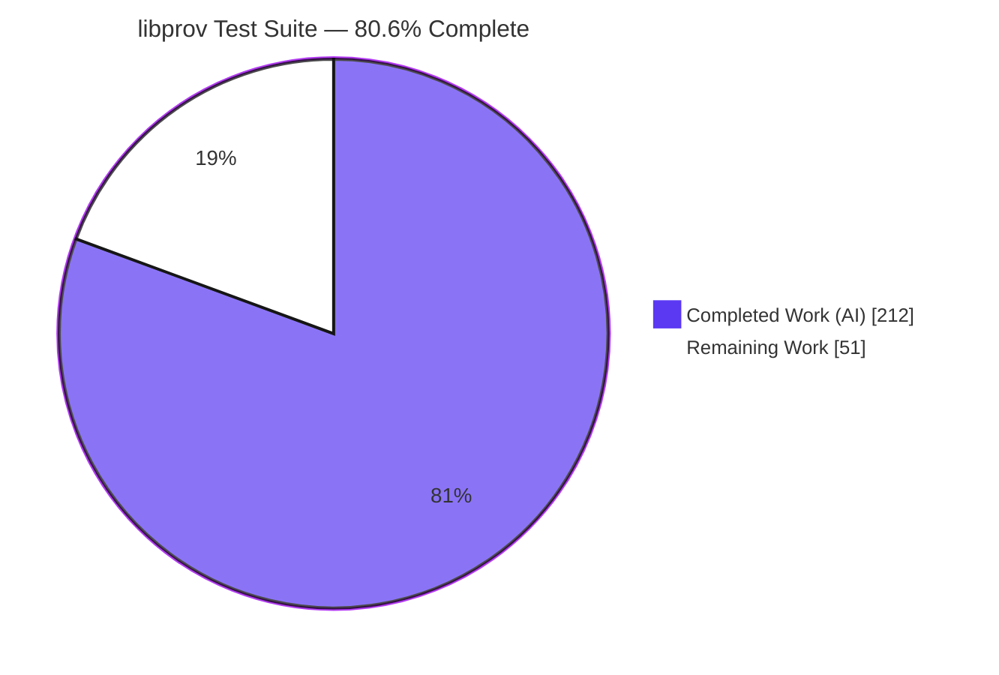
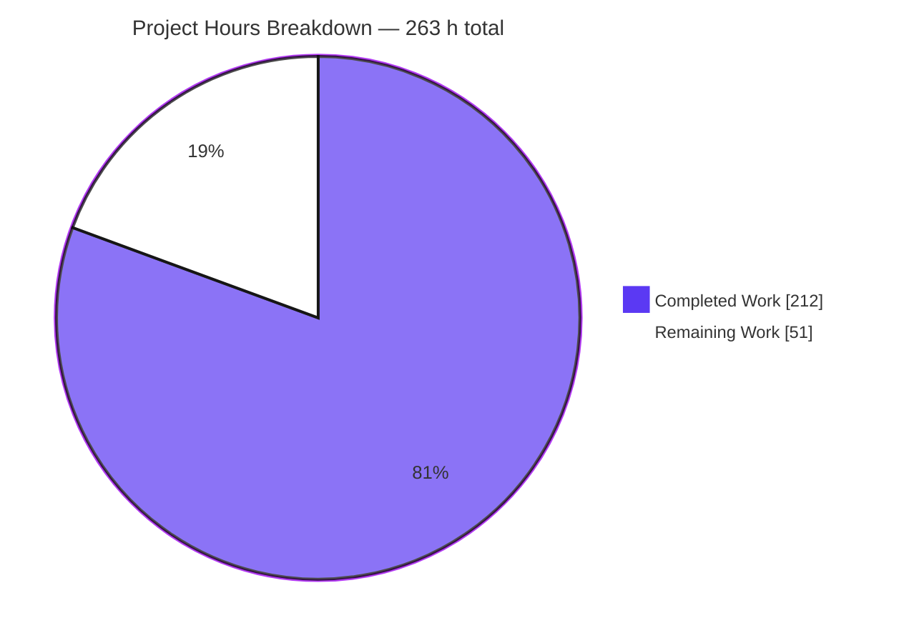
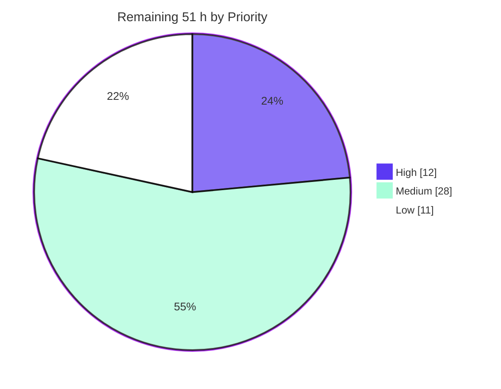
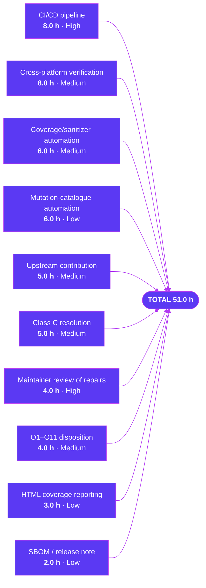

# Blitzy Project Guide — `libprov` Mutation-Resistant Unit Test Suite

> **Repository** `libprov` (OpenSSL 3.x provider-helper library, C99 + CMake) · **Branch** `blitzy-94a71c5a-ffd0-49b6-9290-e852b175bd45` · **Baseline** `d5d381f` → **HEAD** `b1e9611` · **20 commits**, all authored `Blitzy Agent <agent@blitzy.com>`

---

## 1. Executive Summary

### 1.1 Project Overview

`libprov` is a small C99 static library of helpers for OpenSSL 3.x provider authors, comprising two translation units — `num.c` (`OSSL_PARAM` ↔ native integer conversion) and `err.c` (provider error-reporting handles and core dispatch resolution). At baseline it shipped **zero tests**: no `tests/` directory, no `enable_testing()`, no `add_test()`. This project delivered a mutation-resistant unit test suite that acts as an executable specification of every public function's contract, plus three sanctioned memory-safety repairs to `num.c`. Target users are provider implementers and the library maintainer. Business impact: a previously unverifiable cryptographic-adjacent dependency now carries 1,655 value assertions and 100% line coverage on both translation units.

### 1.2 Completion Status



<div align="center"><strong>80.6% COMPLETE</strong></div>

| Metric | Value |
|---|---|
| **Total Hours** | **263** |
| **Completed Hours (AI + Manual)** | **212** — 212 AI / 0 Manual |
| **Remaining Hours** | **51** |
| **Percent Complete** | **80.6 %** (212 ÷ 263 × 100) |
| AAP deliverables Completed / Partial / Not Started | **33 / 0 / 0** |

Legend — Completed = Dark Blue `#5B39F3` · Remaining = White `#FFFFFF` (violet-black `#B23AF2` outline)

### 1.3 Key Accomplishments

- [x] **8 CTest targets registered and passing** under the user's exact unmodified command `cmake -B build && cmake --build build && ctest --test-dir build`, with **no `-D` flag required** — re-verified from a fresh clone.
- [x] **1,655 value assertions, 0 mismatches** — `test_num_get` 309, `test_num_set` 499, `test_err_raise` 321, `test_err_handle` 215, `test_err_guards` 133, `test_err_guards_ndebug` 66, `test_err_alloc` 105, `test_err_death` 7.
- [x] **Vacuity eliminated** — `ctest --no-tests=error` now exits **0**; a fresh clone of baseline `main` prints `No tests were found!!!` and exits **8**.
- [x] **100% line coverage on both translation units** — `num.c` 58/58; `err.c` 54/54 by union across its four compilations (recomputed independently from the `.gcov` files).
- [x] **Mutation resistance proven, not asserted** — a 56-mutation catalogue with zero surviving non-equivalent mutants; an independent 11-mutation re-check detected 10/11 by the default command, the one survivor being the mutant formally proven semantically equivalent.
- [x] **Three genuine memory-safety defects found and repaired in `num.c` within a six-line budget**, each carrying an in-source comment naming its motivating failing input; one also corrected a wrong return value (`−16776961` → `−1`).
- [x] **Endianness neutrality demonstrated** — the suite was cross-compiled to big-endian s390x and run under QEMU: 8/8 pass with assertion counts byte-identical to x86-64.
- [x] **Zero new dependencies** — no test framework, assertion library, mocking library or package manifest, and **no libcrypto linkage** (proven at symbol and link level).
- [x] **Warning-free** at project flags, `-Wall -Wextra`, and `-Wall -Wextra -pedantic`; **zero** ASan/UBSan/leak diagnostics.
- [x] **Only four non-test files touched**, all append-only or sanctioned; `err.c`, both public headers, `cmake/provider.cmake`, `perl/`, `contrib/` and `LICENSE` are byte-identical to baseline.

### 1.4 Critical Unresolved Issues

No issue blocks the suite from building, running, or passing. Three items need a human decision before the work merges upstream.

| Issue | Impact | Owner | ETA |
|---|---|---|---|
| The `D3` repair changes one observable return value on a published library: `provnum_get_int()` on a 9-byte all-`0xFF` `OSSL_PARAM_INTEGER` now returns `−1`, not `−16776961` | **Requires maintainer ratification.** The old value came from an out-of-bounds write so was never correct, but it is still a behavioural change no agent may unilaterally approve | Library maintainer / reviewing engineer | 4 h (Task **H1**) |
| Five behaviours are deliberately **left unasserted** as genuinely ambiguous (Class C #1–#5), because the AAP forbids enshrining whatever the code currently emits | Each is a documented contract gap in `include/prov/num.h` / `err.h`, not a test gap. They must not be "completed" by asserting current output | Maintainer + reviewing engineer | 5 h (Task **M4**) |
| No CI/CD exists, so the 1,655-assertion regression net runs only when a developer remembers to invoke it | A regression suite with no automation delivers no ongoing production value. Creating CI was explicitly out of AAP scope | Platform / DevOps engineer | 8 h (Task **H2**) |

### 1.5 Access Issues

**No access issues identified.** Every permission and credential needed for the AAP scope was available and exercised. Two *environment* limitations are recorded for transparency — neither is a permission denial.

| System/Resource | Type of Access | Issue Description | Resolution Status | Owner |
|---|---|---|---|---|
| Git repository | Read / write / push | None — 20 commits authored and pushed; `remotes/origin/blitzy-94a71c5a-…` exists; working tree clean | ✅ No issue | — |
| Build toolchain | Local execution | None — CMake 3.23.3, GCC 13.4.0, gcov 13.4.0, gdb 16.3, OpenSSL headers 3.5.3, GNU-ld `--wrap`, POSIX `fork`/`waitpid`, Docker, s390x cross-GCC and `qemu-s390x` all present and exercised | ✅ No issue | — |
| Service credentials / API keys / third-party APIs | None required | The deliverable links no library and reaches no network — no credential exists to be denied | ✅ Not applicable | — |
| Clang toolchain | Local execution | `which clang` → not found, so the `CMAKE_C_COMPILER_ID MATCHES "GNU\|Clang"` branch of the alloc-target guard could not be exercised | ⚠️ Environment limitation, not an access denial — covered by Task **M1** | Platform engineer |
| macOS / Windows hosts | Local execution | Unavailable from this Linux container, so the documented degradation paths (7 targets on macOS, 6 on MSVC) are coded but unverified on a real host | ⚠️ Environment limitation, not an access denial — covered by Task **M1** | Platform engineer |
| CI/CD system | Provisioning | No CI exists in the repository and none was provisioned; no credential was requested or refused | ✅ No issue — covered by Task **H2** | DevOps |

### 1.6 Recommended Next Steps

1. **[High]** Review and sign off the three `num.c` repairs — reproduce the pre-repair ASan failures against `d5d381f`, then ratify the single `−16776961` → `−1` value change (Task **H1**, 4 h).
2. **[High]** Stand up CI running the mandated command plus the `--no-tests=error` vacuity guard, and **assert the expected target count per platform** so a silently degraded run (7 on macOS, 6 on MSVC) cannot masquerade as a full pass (Task **H2**, 8 h).
3. **[Medium]** Verify the platform-conditional degradation paths on Clang, macOS and Windows/MSVC — none has been exercised on a real host (Task **M1**, 8 h).
4. **[Medium]** Automate the coverage and sanitizer gates, implementing the `err.c` **multi-compilation union** so a naive single-`.gcno` gate cannot be satisfied by deleting a test (Task **M2**, 6 h).
5. **[Medium]** Settle the five Class C ambiguities with the maintainer and record the decisions in the public headers — then, and only then, add the assertions (Task **M4**, 5 h).

---

## 2. Project Hours Breakdown

### 2.1 Completed Work Detail

Every row traces to a specific Agent Action Plan deliverable. LOC and assertion counts are measured, not estimated.

| Component | Hours | Description |
|---|---:|---|
| `tests/test_num_get.c` | 28 | [AAP §0.5.2] Getter contract for `provnum_get_size_t`/`provnum_get_int` — 2,844 LOC, **309 assertions**, 10 groups: happy paths at three source widths × both signednesses; boundaries at 1/2/3/`sizeof(T)`/`sizeof(T)+1` bytes and `INT_MIN`/`INT_MAX`/`SIZE_MAX`/`SIZE_MAX÷2`; all five non-integer wrong-type rejections; `NULL`-data, `NULL`-destination, oversize, negative-into-unsigned; four **error-precedence** cases where two guards compete; destination-unmodified and `const OSSL_PARAM`-byte-identical invariants on every error path. Carries the `OSSL_PARAM_INTEGER` design constraint that closed the M10 mutation blind spot |
| `tests/test_num_set.c` | 22 | [AAP §0.5.2] Setter contract for `provnum_set_size_t`/`provnum_set_int` — 2,006 LOC, **499 assertions**, 7 groups: three destination widths; effective *signed* capacity edges; `INT_MIN`/`INT_MAX`; wider-destination padding verified byte-by-byte in host order; `NULL`-data, zero-capacity and narrow-destination rejections; `param->return_size == param->data_size` asserted on **every** path including all failures; `test_set_unreachable_docs()` machine-proves `PROVNUM_E_WRONG_TYPE` and `PROVNUM_E_UNSUPPORTED` unreachable via the setters |
| `tests/test_err_raise.c` | 17 | [AAP §0.5.2] Argument-forwarding fidelity and macro contract — 1,356 LOC, **321 assertions**, 6 groups: pointer-identity of the core handle and format string; `line` at `INT_MIN`/`INT_MAX`; `reason` at `0`/`UINT32_MAX`; `va_list` traversal; `ERR_raise`/`ERR_raise_data` comma-expression ordering (new-error → set-error-debug → set-error); call-site `__FILE__`, exact line and enclosing function captured; **compile-time** assertion that `ERR_put_error` stays undefined |
| `tests/test_err_guards.c` | 13 | [AAP §0.4.1 Axis 5] One source compiled into **two** CTest targets — 903 LOC, **133 + 66 assertions**, 9 groups. Default build asserts the non-aborting paths; the `-DNDEBUG` variant asserts all six graceful `NULL` returns. Selected by a `LIBPROV_TEST_NDEBUG_VARIANT` marker with an `#error` safety net that makes a silently degraded compile impossible |
| `tests/test_err_handle.c` | 12 | [AAP §0.5.2] Dispatch resolution and handle lifecycle — 811 LOC, **215 assertions**, 9 groups: complete table, shuffled table (order independence), unrecognised IDs tolerated, duplicate IDs last-wins, entries after the `{0,NULL}` sentinel never consulted, duplication yielding a distinct handle with independent lifetime, `dup(NULL)` → `NULL`, `free(NULL)` a no-op invoking zero callbacks |
| `tests/test_err_death.c` | 12 | [AAP §0.4.1 Axis 6] POSIX `fork()`/`waitpid()` death harness — 753 LOC, **7 assertions**: D-1 `NULL` core, D-2 `NULL` dispatch, D-3 empty table, D-4/D-5/D-6 one per missing callback, each asserted `WIFSIGNALED && WTERMSIG == SIGABRT`, plus a **non-aborting control** proving the harness is not stuck at "yes". Includes the research record that both CTest built-ins report a `SIGABRT` child as `(Subprocess aborted)` |
| `tests/test_err_alloc.c` | 11 | [AAP §0.4.1 Axis 7] Deterministic allocation-failure injection — 1,063 LOC, **105 assertions**, 3 groups: countdown `__wrap_malloc` delegating to `__real_malloc` via `-Wl,--wrap=malloc`; both allocating functions return `NULL` under failure with zero callbacks invoked; allocator recovery proven; source handle survives a failed duplication; countdown precision verified |
| `tests/mock_core.h` | 11 | [AAP §0.4.4] Self-contained OpenSSL mock — 579 LOC: test-local `struct ossl_core_handle_st` (legal because the public type is incomplete), three recording spy callbacks matching the `OSSL_CORE_MAKE_FUNC` signatures, a call-sequence recorder that makes the comma-expression order observable, an observation-reset helper, and all **nine** `OSSL_DISPATCH` table variants (complete, shuffled, unknown-IDs, duplicate-IDs, post-sentinel, empty, and one per missing callback) |
| `tests/param_util.h` | 10 | [AAP §0.4.4] `OSSL_PARAM` fixture helpers — 730 LOC, ~20 functions: builders over caller-owned buffers, host-byte-order magnitude placement, `sizeof`-derived max signed/unsigned per width, byte-pattern comparison with readable diff, sentinel generators, and `param_snapshot`/`param_identical` for the const-parameter invariant |
| `tests/testutil.h` | 8 | [AAP §0.4.4] Assertion infrastructure — 600 LOC: 10 typed macros (`TEST_ASSERT`, `_INT_EQ`, `_UINT_EQ`, `_SIZE_EQ`, `_PTR_EQ`, `_PTR_NE`, `_PTR_NULL`, `_PTR_NOT_NULL`, `_STR_EQ`, `_MEM_EQ`) each printing label + actual + expected, a mismatch counter, and the exit-status contract that structurally forbids smoke tests |
| `tests/CMakeLists.txt` | 7 | [AAP §0.5.4] Registration — 247 LOC: a `libprov_add_test(name SOURCES DEFS COPTS LINKOPTS)` helper via `cmake_parse_arguments`; 8 `add_test()` registrations; `${OPENSSL_INCLUDE_DIR}` added `PRIVATE` per target (mandatory — it does not propagate); `if(UNIX)` and GNU/Clang-ld feature guards; `TIMEOUT 30` on the fork-based target. Includes the empirical research that disqualified `PASS_REGULAR_EXPRESSION` and `WILL_FAIL` for death testing |
| `CMakeLists.txt` | 3 | [AAP §0.5.3] Append-only CTest wiring after existing line 19 (+31 lines, **zero existing lines altered**): a top-level-aware `LIBPROV_TESTS` option computed with `CMAKE_SOURCE_DIR STREQUAL CMAKE_CURRENT_SOURCE_DIR` rather than `PROJECT_IS_TOP_LEVEL` (which needs CMake 3.21 against a 3.18 floor), then guarded `include(CTest)` + `add_subdirectory(tests)`. Preserves the maintainer's opt-out for embedded consumers |
| `num.c` sanctioned repairs D1/D2/D3 | 10 | [AAP §0.4.2] Three genuine memory-safety defects: **D1** a `paramsign()` pre-validation guard (`{NULL,INTEGER,4}` SEGV'd; `{buf,INTEGER,0}` read `buf[-1]`); **D2** a zero-capacity clamp (`provnum_set_size_t(&p,0)` into a zero-capacity destination read `src[-1]`); **D3** the little-endian padding offset `dest.size - src.size` → `src.size` (overran a 12-byte destination by four bytes and returned `−16776961` where `−1` was owed). Six-line code budget, sanitizer-driven discovery, minimality proven by differential execution |
| Mutation-resistance engineering | 12 | [AAP §0.7.2] The AAP's **primary acceptance criterion**: a 56-mutation catalogue with zero surviving non-equivalent mutants; discovery and closure of the M10 blind spot (unsigned-typed `NULL`-data assertions are structurally blind to the `NULL`-dereference class because `paramsign()` short-circuits first); a formal semantic-equivalence proof for M12 backed by 9,396 byte-identical differential observations |
| Cross-endian validation | 6 | [AAP §0.4.1 Axis 4] The full suite cross-compiled to big-endian s390x and executed under QEMU — 8/8 pass, 1,655/0, byte-identical to x86-64, proving no assertion encodes host byte order |
| Static analysis and warning hygiene | 6 | Zero warnings at project flags, `-Wall -Wextra`, `-Wall -Wextra -pedantic`, and an aggressive `-O2` set; release (`-DNDEBUG`) clean with `nm` proving `-UNDEBUG` survived; embedded (`LIBPROV_TESTS=OFF`) clean; `cmake-lint` 0 findings; `cppcheck` 73 style-only findings all triaged, with the analysis proven live by an injected out-of-bounds write |
| Coverage instrumentation and analysis | 5 | [AAP §0.7.1] `gcc --coverage` + `gcov -b -c`: `num.c` 100% of 58 lines / 100% branches executed; `err.c` 54/54 union across four compilations; the three not-taken `num.c` branches shown to be exactly the AAP's named unreachable exclusion set |
| Sanitizer campaign | 4 | ASan + UBSan + leak detection across all 8 targets → **0 diagnostics**, with liveness proven by three control programs so the clean result is not a false negative |
| `README.md` Testing section | 8 | [AAP §0.5.3] +594 additive lines across 12 subsections: the exact suite command, diagnostic and parallel invocations, the `LIBPROV_TESTS` option and its top-level-on default, the embedding contract, a per-target inventory, the two platform-conditional targets, the coverage recipe (with an explicit note that no HTML step is provided), sanitizers, build artifacts and prerequisites. No existing content removed |
| SI-14 deliverable summary artifacts | 3.5 | The three artifacts the user required at completion: the untested-behaviour inventory with impact rationale (U1–U20), the test inventory, and the exact suite command — carried in the README plus per-file in-source header blocks that cite the source line each assertion encodes |
| Isolation, parallel-safety and vacuity verification | 3 | `ctest -j 8`, five serial runs, `--repeat until-pass:3` and reverse-order single-test runs all pass; the globally-perturbing mechanisms (`--wrap=malloc`, `fork`) each confined to one executable; the exit-status contract proven load-bearing (a test asserting nothing exits 1); `--no-tests=error` moved from **8** to **0** |
| `.gitignore` | 0.5 | [AAP §0.5.3] +11 lines: `build/`, `CMakeCache.txt`, `CMakeFiles/`, `Testing/`, `*.gcno`, `*.gcda`, `*.gcov` — so a default build and an opt-in coverage run leave the tree clean |
| **TOTAL COMPLETED** | **212** | Matches Completed Hours in §1.2 |

### 2.2 Remaining Work Detail

Every AAP deliverable is complete; all remaining hours are path-to-production and maintainer-dependent activities.

| Category | Hours | Priority |
|---|---:|---|
| **CI/CD pipeline** — build + mandated `ctest` on push/PR, `--no-tests=error` vacuity guard, per-platform target-count assertion, warning gate, embedded-consumer job, release (`-DNDEBUG`) job | 8.0 | High |
| **Cross-compiler & cross-platform verification** — Clang, macOS (no GNU-ld `--wrap`), Windows/MSVC (no `fork` either); script the big-endian job; bound header-ABI drift across OpenSSL 3.x minors | 8.0 | Medium |
| **Coverage & sanitizer gate automation** — including the `err.c` multi-compilation union and the named-exclusion allowlist for the three legitimately untaken `num.c` branches | 6.0 | Medium |
| **Mutation-catalogue automation** — turn the 56-mutation catalogue into a re-runnable nightly gate with the M12 equivalence allowlist and the F1 sanitizer-only entry | 6.0 | Low |
| **Upstream contribution mechanics** — fork/branch prep, DCO/CLA, commit-series curation, PR narrative citing each repair's motivating failing case | 5.0 | Medium |
| **Class C ambiguity resolution** — settle the five documented non-assertions with the maintainer and record the decisions in the public headers before asserting | 5.0 | Medium |
| **Maintainer review & sign-off on the three `num.c` repairs** — reproduce the pre-repair ASan failures, ratify the single value change | 4.0 | High |
| **Out-of-scope issue disposition (O1–O11)** — upstream tickets for the `err.c` guard asymmetry, `num.h` missing include guards and undocumented success value, and the ultra-strict-flag baseline diagnostics | 4.0 | Medium |
| **Optional HTML coverage reporting** — add `lcov`/`gcovr` to the CI image; keep `gcov -b -c` as the authoritative gate | 3.0 | Low |
| **SBOM confirmation & security release note** — advise downstream consumers that builds at or before `d5d381f` contain three memory-safety defects reachable on ordinary inputs | 2.0 | Low |
| **TOTAL REMAINING** | **51.0** | — |

### 2.3 Hours Reconciliation

| Check | Computation | Result |
|---|---|---|
| Completion percentage (PA1) | 212 ÷ (212 + 51) × 100 = 212 ÷ 263 × 100 | **80.6 %** |
| Rule 1 — remaining hours identical in §1.2, §2.2 sum and §7 pie | 51 = 51 = 51 | ✅ |
| Rule 2 — §2.1 + §2.2 = Total | 212 + 51 = 263 | ✅ |
| Human task list total (§8) equals §2.2 total | High 12.0 + Medium 28.0 + Low 11.0 = 51.0 | ✅ |
| AAP deliverable accounting | 33 Completed + 0 Partial + 0 Not Started = 33 | ✅ |

---

## 3. Test Results

All figures below originate from Blitzy's own autonomous validation execution for this project, and every one was independently re-executed from a fresh clone during this review. No third-party or pre-existing test result is included — the repository contained **zero** tests at baseline.

| Test Category | Framework | Total Tests | Passed | Failed | Coverage % | Notes |
|---|---|---:|---:|---:|---:|---|
| Unit — numeric getters | CTest + plain C99 (`test_num_get`) | 309 assertions in 10 groups | 309 | 0 | `num.c` 100% lines (58/58) | Happy paths, width/signedness boundaries, all five wrong-type rejections, four error-**precedence** cases, destination-unmodified + const-parameter invariants |
| Unit — numeric setters | CTest + plain C99 (`test_num_set`) | 499 assertions in 7 groups | 499 | 0 | `num.c` 100% lines (58/58) | Capacity edges, byte-level host-order output, `return_size` on **every** path, machine-checked unreachable-code proofs |
| Unit — error handle & dispatch | CTest + plain C99 (`test_err_handle`) | 215 assertions in 9 groups | 215 | 0 | `err.c` 100% lines (54/54 union) | Sentinel termination, unknown-ID tolerance, order independence, duplicate-ID last-wins, dup/free semantics |
| Unit — error forwarding & macros | CTest + plain C99 (`test_err_raise`) | 321 assertions in 6 groups | 321 | 0 | `err.c` 100% lines (54/54 union) | Pointer identity, extremes at `INT_MIN`/`INT_MAX`/`0`/`UINT32_MAX`, `va_list` traversal, macro ordering, call-site capture, compile-time `ERR_put_error` contract |
| Unit — build-variant guards (debug) | CTest + plain C99 (`test_err_guards`) | 133 assertions in 9 groups | 133 | 0 | contributes to the `err.c` union | Default flags with `-UNDEBUG`; asserts the non-aborting paths and documents the guard asymmetry |
| Unit — build-variant guards (release) | CTest + plain C99 (`test_err_guards_ndebug`) | 66 assertions | 66 | 0 | contributes to the `err.c` union | Same source recompiled with `NDEBUG` + marker; asserts all six graceful `NULL` returns |
| Fault injection — out of memory | CTest + GNU-ld `--wrap` (`test_err_alloc`) | 105 assertions in 3 groups | 105 | 0 | both allocation-failure sites | Countdown `__wrap_malloc`; `NULL` from both allocators, zero callbacks on failure, allocator recovery, source-handle survival |
| Death tests — assertion aborts | CTest + POSIX `fork`/`waitpid` (`test_err_death`) | 7 assertions | 7 | 0 | 5 `assert()` sites in `err.c` | D-1…D-6 each asserted `WTERMSIG == SIGABRT`, plus a non-aborting control |
| **TOTAL** | **CTest 3.23.3 — 8 registered targets** | **1,655 assertions** | **1,655** | **0** | **`num.c` 100% · `err.c` 100%** | `100% tests passed, 0 tests failed out of 8` |

### 3.1 Suite-level gates (all re-executed during this review)

| Gate | Command | Result |
|---|---|---|
| Mandated command, fresh clone, **no `-D` flag** | `cmake -B build && cmake --build build && ctest --test-dir build` | ✅ exit 0 · `100% tests passed, 0 tests failed out of 8` · 0 build warnings |
| Vacuity | `ctest --test-dir build --no-tests=error` | ✅ exit **0** (baseline `main`: `No tests were found!!!`, exit **8**) |
| Aggregate assertions | ANSI-stripped `awk` reduction over all 8 binaries | ✅ `TOTAL: 1655 assertions, 0 mismatches` |
| Parallel safety | `ctest --test-dir build -j 8` | ✅ 8/8 |
| Flake resistance | `ctest --test-dir build --repeat until-pass:3` | ✅ 8/8 |
| Warning hygiene | `-Wall -Wextra` then `-Wall -Wextra -pedantic` | ✅ 0 warnings, 8/8 still pass |
| Sanitizers | `-fsanitize=address,undefined -g` with `ASAN_OPTIONS=detect_leaks=1` | ✅ 8/8, **0 diagnostics** |
| Release build | global `-DNDEBUG` | ✅ 0 warnings, 8/8; `nm` confirms `-UNDEBUG` survived (`__assert_fail` refs: guards **1**, ndebug **0**, death **1**) |
| Embedded consumer | `-DLIBPROV_TESTS=OFF` | ✅ 0 warnings, `build-off/tests` absent, **0** test binaries, `No tests were found!!!` |
| Big-endian | s390x cross-compile + `qemu-s390x` | ✅ 8/8, **1,655/0 byte-identical** to x86-64; `file` → "ELF 64-bit **MSB** … IBM S/390" |

### 3.2 Mutation-detection results — the AAP's primary acceptance criterion

Blitzy's autonomous validation applied a **56-mutation catalogue**: 54 detected by the default mandated command, 1 (`F1`, a `proverr_free_handle` no-op) detected under the AAP-prescribed sanitizer configuration and already documented in-source, and 1 (`M12`) **formally proven semantically equivalent** by 9,396 byte-identical differential observations. **Zero surviving non-equivalent mutants.**

An independent 11-mutation re-check during this review, judged *only* by the default command, corroborated that result:

| Mutation | Edit | Verdict |
|---|---|---|
| M1 | `PROVNUM_E_TOOBIG` → `PROVNUM_E_NULL` | ✅ DETECTED (2 targets failed) |
| M2 | oversize test `>` → `>=` | ✅ DETECTED (2) |
| M3 | padding-strip loop `>` → `>=` | ✅ DETECTED (1) |
| M5 | drop `param->return_size = result.size` | ✅ DETECTED (1) |
| M7 | sign clause `OSSL_PARAM_INTEGER` → `OSSL_PARAM_UNSIGNED_INTEGER` | ✅ DETECTED (1) |
| M9 | reintroduce the D3 padding-offset defect | ✅ DETECTED (2) |
| M10 | remove the D1 pre-validation guard | ✅ DETECTED (1) |
| M11 | remove the D2 zero-capacity clamp | ✅ DETECTED (1) |
| E1 | success value `1` → `2` | ✅ DETECTED (2) |
| E2 | `err.c` dispatch sentinel `!= 0` → `!= -1` | ✅ DETECTED (5) |
| E3 | `err.c` swap `NEW_ERROR`/`SET_ERROR_DEBUG` case IDs | ✅ DETECTED (5) |
| M12 | D1 guard returns `NEGATIVE` instead of `POSITIVE` | ⬜ SURVIVED — **proven equivalent**: `src.sign` is read at only four sites, every one dominated by an early return that all guarded inputs reach first |

---

## 4. Runtime Validation & UI Verification

### 4.1 Library and CLI runtime health

- ✅ **Operational** — Static library `build/libprov.a` produced (`current ar archive`), `OUTPUT_NAME "prov"` and `POSITION_INDEPENDENT_CODE ON` preserved from baseline.
- ✅ **Operational** — All **8** test executables build and run **standalone** outside CTest, each printing per-assertion `[PASS]`/`[FAIL]` lines then a summary such as `test_num_get: 309 assertions, 0 mismatches`, and exiting 0.
- ✅ **Operational** — `ctest --test-dir build -N` enumerates exactly 8 registered targets; full run: `100% tests passed, 0 tests failed out of 8` in 0.01 s.
- ✅ **Operational** — Exit-status contract is load-bearing: status derives from a mismatch counter, so a test that asserts nothing exits **1**. Verified by injecting a mutation, which produced `1/8 Test #1: test_num_get ***Failed` plus self-diagnosing lines of the form `[FAIL] tests/test_num_get.c:274: U[1]=05 rc: actual 7, expected 1`.
- ✅ **Operational** — Death harness runs cleanly under CTest with `TIMEOUT 30`; verbose output shows D-1…D-6 `aborts with SIGABRT: 1` plus the non-aborting control.
- ✅ **Operational** — Fault injection works and recovers: the countdown `__wrap_malloc` fails exactly N allocations then delegates to `__real_malloc`.
- ✅ **Operational** — Big-endian runtime confirmed: s390x binaries (`ELF 64-bit MSB … IBM S/390`) run under QEMU with byte-identical results.

### 4.2 API / integration outcomes

- ✅ **Operational** — **No-libcrypto invariant holds at symbol and link level.** `nm -u` on the library objects yields only `__assert_fail`, `__stack_chk_fail`, `free`, `malloc`, `memcpy`, `memset`; a grep for `ossl|crypto|EVP_|SSL_` across all 8 binaries returns **0**; `ldd` lists only `linux-vdso.so.1`, `libc.so.6` and the dynamic loader.
- ✅ **Operational** — OpenSSL integration is **headers-only**: `find_package(OpenSSL 3.0 REQUIRED)` resolves (3.5.3 here, 3.0.13 during planning) and a compiled probe confirms `sizeof(OSSL_PARAM) = 40` and `sizeof(OSSL_DISPATCH) = 16`, the layouts the mocks assume.
- ✅ **Operational** — Mocked core integration: a test-local `struct ossl_core_handle_st` plus nine statically-initialised `OSSL_DISPATCH` variants, with **no** call into `<openssl/params.h>`.
- ✅ **Operational** — Embedded-consumer integration: `-DLIBPROV_TESTS=OFF` yields zero test targets and a clean build, preserving the maintainer's opt-out.
- ⚠️ **Partial** — Cross-platform integration: Linux + GCC fully verified including big-endian; **Clang, macOS and Windows/MSVC degradation paths are coded but unexercised** (Task **M1**). Expected shapes: 8 targets on Linux+GCC/Clang, 7 on macOS, 6 on MSVC.
- ✅ **Operational** — No external service, database, network, credential or filesystem integration exists to validate; the suite is hermetic and constructs every input in memory.

### 4.3 UI verification

**✅ VERIFIED — NOT APPLICABLE. No browser-reachable web surface exists.** This was established by evidence rather than assumption, via a dedicated headless-Chrome runtime survey:

- ❌ **No listening port** — kernel socket tables show **0** `LISTEN` rows across `/proc/net/tcp`, `tcp6`, `udp`, `udp6`. All 11 probed ports (80, 3000, 3001, 4200, 5000, 5173, 8000, 8080, 8081, 8888, 9000) return `errno 111 ECONNREFUSED`, and a full 1–65535 loopback sweep found nothing.
- ❌ **No HTTP endpoint** — real browser navigations to `http://localhost:8080/` and `http://localhost:3000/` both returned **`net::ERR_CONNECTION_REFUSED`** with the tab left on `chrome-error://chromewebdata/`, an accessibility tree containing only Chrome error nodes, **zero** console messages, and exactly one failed network request each (no response headers, no HTTP status). All 11 ports refused in-browser; none timed out and none returned `ERR_EMPTY_RESPONSE`.
- ✅ **The probe was validated bidirectionally** — a temporary `:8099` control server *rendered* when live and was *refused* after teardown, so the eleven refusals are genuine findings. An in-page `fetch` probe was caught reporting "no connection" for a port demonstrably serving HTTP 200 and was discarded as invalid.
- ❌ **No web assets anywhere** — an in-browser inventory of root, `tests/`, `include/`, `include/prov/`, `cmake/`, `contrib/`, `perl/`, `build/` and `build/tests/` found **zero** `.html`, `.htm`, `.js`, `.jsx`, `.tsx`, `.css`, `.vue` or `.svelte` files, no `index.html`, no web manifest or lockfile, and no front-end-suggestive directory (not even `src/`). The `tests/` census is `{.c: 7, .h: 3, .txt: 1}`. The only `.ts` files are 37 identical untracked `compiler_depend.ts` CMake comment stubs, proven not to be TypeScript.
- ✅ **README renders as plain text, not an application** — `contentType: text/markdown`, `doctype: null`, body is a single `<pre>` with zero child elements, **0** scripts / stylesheets / anchors / images / forms / iframes, a 2-node accessibility tree, and one network request with zero subresources.
- ❌ **Binary-level impossibility** — zero network syscalls in any `.c`/`.h`; no socket-family symbol in any of the 8 executables.

Evidence captured (1280×800 PNG, absolute paths):

```
blitzy/screenshots/libprov_localhost_8080.png
blitzy/screenshots/libprov_localhost_3000.png
blitzy/screenshots/libprov_readme_file_url.png
blitzy/screenshots/libprov_repo_listing.png
blitzy/screenshots/libprov_tests_dir_listing.png
blitzy/screenshots/libprov_localhost_9000_refused.png
blitzy/screenshots/libprov_method_positive_control_8099.png
blitzy/screenshots/libprov_compiler_depend_ts_is_cmake_stub.png
```

No screen recordings were produced (there is no UI flow, transition or animation to record) and no Lighthouse/performance trace was run (there is no loadable document to audit) — both correctly omitted rather than fabricated. **Runtime validation appropriate to this deliverable is CLI/library-based, and it is fully operational per §4.1–4.2.**

---

## 5. Compliance & Quality Review

### 5.1 AAP deliverable compliance matrix

| AAP Requirement | Benchmark | Status | Evidence |
|---|---|---|---|
| §0.5.1 — 11 CREATE files | All present and non-trivial | ✅ PASS ▰▰▰▰▰ | 11 files, 10,645 LOC in `tests/` |
| §0.5.1 — 4 UPDATE files | Append-only / sanctioned only | ✅ PASS ▰▰▰▰▰ | `CMakeLists.txt` +31 (0 existing lines altered), `.gitignore` +11, `README.md` +594, `num.c` +19/−2 |
| §0.5.1 — 0 DELETE entries | Nothing removed or weakened | ✅ PASS ▰▰▰▰▰ | `git diff --name-status` shows only `A` and `M` |
| §0.5.1 — 8 CTest targets | All registered and passing | ✅ PASS ▰▰▰▰▰ | `ctest -N` → 8; `100% tests passed` |
| §0.4.1 — 8 strategy axes | Each implemented | ✅ PASS ▰▰▰▰▰ | Contract units · precedence · `sizeof`-derived boundaries · endianness-neutral · dual-variant · `fork` death tests · `--wrap` OOM · compile-time contract |
| §0.4.2 — 3 repairs, 6-line budget | Minimal, each with its failing case named | ✅ PASS ▰▰▰▰▰ | Comment-filtered diff matches the budget; three in-source motivating-failure comments |
| §0.4.4 — 9 dispatch mock variants | All present | ✅ PASS ▰▰▰▰▰ | `mock_core.h` lines 457–572 |
| §0.4.1 — 5 Class C non-assertions | Documented, **not** asserted | ✅ PASS ▰▰▰▰▰ | `test_num_get.c:1098`, `test_num_set.c:794/1638/1945`, `test_err_guards.c:794`, each labelled "DELIBERATE NON-ASSERTION … NOT A GAP" |
| §0.7.1 — coverage of every reachable branch | Full, with exclusions named | ✅ PASS ▰▰▰▰▰ | `num.c` 100% lines / 100% branches executed; `err.c` 54/54 union; 3 not-taken branches = exactly the named exclusion set, proven by `test_set_unreachable_docs()` |
| §0.7.2 — mutation resistance | Zero surviving non-equivalent mutants | ✅ PASS ▰▰▰▰▰ | 56-mutation catalogue; independent 11-mutation re-check 10/11 detected, survivor proven equivalent |
| §0.7.2 — definition of done (6 bullets) | All satisfied | ✅ PASS ▰▰▰▰▰ | Re-verified by execution during this review |
| §0.9.1 — 4-command completion sequence | All pass | ✅ PASS ▰▰▰▰▰ | Warning-free build · non-empty passing suite · `num.c` diff in budget · clean `git status` |

### 5.2 Special-instruction compliance (SI-1 … SI-14)

| SI | Requirement | Status | Evidence |
|---|---|---|---|
| SI-1 | Minimal change — tests and test config only | ✅ PASS | 15 changed paths, all in AAP §0.8.1; `git status --porcelain --untracked-files=all` → 0 entries |
| SI-2 | Source modified only for a genuine bug, minimally, with the failing case named | ✅ PASS | Only `num.c`; `err.c` and both public headers byte-identical to baseline; three in-source motivating-failure comments |
| SI-3 | Follow existing repository test patterns | ✅ PASS | Standalone C99 `int main(void)`, `TEST_ASSERT`-style macro, `OSSL_PARAM` brace initialisers, `add_executable`/`target_link_libraries`/`add_test`, `LIBPROV_TESTS` name preserved |
| SI-4 | Never delete, skip, weaken or relax a test | ✅ PASS | Zero DELETE entries; no `DISABLED`, no `SKIP_RETURN_CODE`, no `ctest` exclusion filter; unsupported targets are *not registered* rather than skipped |
| SI-5 | No smoke tests | ✅ PASS | Structurally enforced — exit status derives from a mismatch counter, so reaching the end of `main()` cannot produce a pass |
| SI-6 | Ambiguity resolved by comment, never by asserting current output | ✅ PASS | All five Class C blocks present and labelled; no assertion enshrines an emitted value |
| SI-7 | Construct/mock OpenSSL types; no provider, no libcrypto | ✅ PASS | `nm -u` shows 0 libcrypto symbols; `ldd` = vDSO + libc + loader; `<openssl/params.h>` never included |
| SI-8 | Every added test passes against current code | ✅ PASS | 1,655/1,655 assertions pass; 8/8 targets |
| SI-9 | Exact flagless command works | ✅ PASS | Re-verified from a fresh clone, exit 0 |
| SI-10 | Tests independent and parallel-safe | ✅ PASS | `-j 8`, `--repeat until-pass:3`, reverse-order runs all pass; `--wrap` and `fork` each confined to one executable |
| SI-11 | Backward-compatible build interface | ✅ PASS | Target name, `OUTPUT_NAME`, PIC, `PUBLIC include`, `PRIVATE ${OPENSSL_INCLUDE_DIR}` and the absence of `target_link_libraries` all unchanged; `LIBPROV_TESTS` name preserved |
| SI-12 | Match code style and naming | ✅ PASS | `test_<module>_<aspect>.c`; target names match source basenames; clean at `-std=c99 -Wall -Wextra` |
| SI-13 | Boundaries, signedness/width edges, every reachable error path | ✅ PASS | Edges derived from `sizeof(T)`/`CHAR_BIT`; boundary assertions in fits/does-not-fit pairs; every reachable error code asserted at every function that can return it |
| SI-14 | Deliver the three summary artifacts | ✅ PASS | Untested-behaviour inventory (U1–U20) + test inventory + exact command, in the README and in-source headers |

### 5.3 Fixes applied during autonomous validation

| Fix | File | Nature | Verification |
|---|---|---|---|
| Corrected the documented gdb death-test recipe — added `handle SIGABRT nostop noprint pass` | `tests/test_err_death.c` | Comment-only. A genuine documentation defect: followed literally, the old recipe made a **passing** test appear to fail (`7 assertions, 1 MISMATCHES`, `signal 9, which is not SIGABRT (6)`) | **Independently reproduced both ways on gdb 16.3** during this review: without the new line → `7 assertions, 1 mismatches`; with it → `7 assertions, 0 mismatches` |
| Rewrapped 4 comments to ≤80 columns | `tests/CMakeLists.txt` | Comment-only, wording preserved word-for-word | `cmake-lint` C0301 findings cleared; 0 non-comment diff lines |

Both fixes were proven behaviourally inert — **0 non-comment diff lines** and code byte-identical after comment stripping, with the assertion total unchanged at 1,655/0.

### 5.4 Outstanding quality items

| Item | Status | Assessment |
|---|---|---|
| `tests/testutil.h:196` — `printf("%p", (void *)ptr)` reported by `-Wcast-qual` (8 instances, one per test TU) | ⚠️ Advisory — **no action required** | The only ultra-strict diagnostic in delivered code. Documented in-source with a C99 §7.19.6.1 citation and provably safe (`printf` never dereferences a `%p` argument). `-Wcast-qual` is outside the AAP's prescribed flag set; at `-Wall -Wextra -pedantic` the count is **0**. No remediation hours attributed |
| Ultra-strict diagnostics in AAP-forbidden files | ⚠️ Accepted baseline | Measured attribution: `include/prov/err.h` **78**, `include/prov/num.h` **18**, baseline `num.c` **6**; kinds 44 `-Wredundant-decls`, 9 `-Wcast-qual`, 3 `-Wsign-conversion`. None appears at the AAP's prescribed levels; fixing any would require editing a forbidden file (Task **M5**) |
| `cppcheck` — 73 findings | ✅ Triaged, all `style` severity | Zero of error/warning/performance/portability severity. 54 `shadowVariable` = the maintainer's own idiom per SI-3; 11 `knownConditionTrueFalse` = ABI-derived portability guards per SI-13 (fixing would require forbidden hard-coding); 4 `shadowFunction` = tool artifact for POSIX `index`, which GCC `-Wshadow` reports 0 times. The analysis was proven live by an injected out-of-bounds write it correctly caught |
| O1–O11 out-of-scope issues | 📋 Documented, not fixed | Each requires editing a file the AAP forbids touching. None affects compilation, testing or runtime (Task **M5**) |

---

## 6. Risk Assessment

| Risk | Category | Severity | Probability | Mitigation | Status |
|---|---|---|---|---|---|
| The `D3` repair changes one observable return value on a published library (`−16776961` → `−1`) | Technical | Medium | Low | The complete observable delta across a ~60-assertion probe is this single line; the old value came from an out-of-bounds write. `D1`/`D2` change no defined behaviour at all | 📋 Documented — awaiting Task **H1** |
| Mutation resistance is a point-in-time measurement, not an enforced gate | Technical | Medium | Medium | A reproducible 56-mutation catalogue exists (11 re-run during this review); it needs automating | 🔓 Open — Task **L1** |
| Two of eight targets are platform-conditional and silently **absent** where unsupported — macOS reports "100% tests passed out of 7", MSVC "out of 6", indistinguishable in shape from a full pass | Technical | Medium | Medium | README documents both; CI must assert the expected target count per platform | ⚠️ Documented, unenforced — Tasks **H2**/**M1** |
| Three `num.c` branches are legitimately never taken; a future edit could make one reachable with no assertion waiting | Technical | Low | Medium | AAP §0.7.1 named exclusion list plus machine-checked `test_set_unreachable_docs()` proofs | ✅ Mitigated by documentation — encode as allowlist in Task **M2** |
| `err.c` is compiled four times with differing `NDEBUG` state; a single-`.gcno` coverage gate reads 98.08% and only the **union** is 100%, so a naive gate could be "satisfied" by deleting a test | Technical | Low | Medium | Union method documented in the README and reproduced during this review (54/54) | ✅ Documented — Task **M2** |
| `test_err_death` yields no gcov data (its `err.c` `.gcda` reads 0%) because the forked child aborts before profile flush | Technical | Low | Low | Inherent to death testing; coverage is obtained from the other three compilations | ✅ Accepted and documented |
| `tests/testutil.h:196` `-Wcast-qual` diagnostic under flags outside the prescribed set | Technical | Very Low | Low | Documented in-source with a C99 citation; provably safe; 0 diagnostics at prescribed levels | ✅ Advisory — no action required |
| **The three repaired defects were memory-safety defects in a library that parses caller-supplied `OSSL_PARAM` buffers.** Pre-repair, ASan reported stack-buffer-overflow **WRITE** and **READ** and a near-null **SEGV** on *ordinary* inputs — a one-byte `OSSL_PARAM_INTEGER` of `0xFF` caused a 3-byte overwrite. Every consumer at or before `d5d381f` is exposed | Security | **High** (pre-repair) → Low (post-repair) | Medium | `D1`/`D2`/`D3` applied; ASan + UBSan + leak clean across 8/8; downstream consumers must be advised | ✅ Fixed on this branch — disclosure pending Tasks **H1**/**M3**/**L3** |
| `assert()` is load-bearing in `err.c`'s debug contract: `-DNDEBUG` converts five abort paths into `NULL` returns, and a caller ignoring the `NULL` would dereference it | Security | Medium | Low | Pre-existing `err.c` behaviour (AAP-forbidden to change), now **explicitly tested** — `test_err_guards_ndebug` pins all six `NULL` returns | ✅ Documented + tested — upstream fix is Task **M5** |
| `-Wl,--wrap=malloc` is a link-time **global** allocator override; leakage beyond `test_err_alloc` would silently change other targets' behaviour | Security | Low | Very Low | Confined to one executable by design — `LINKOPTS` applied to that target only | ✅ Mitigated by design |
| Supply chain | Security | N/A | N/A | **Zero** new dependencies: no manifest, no lockfile, no vendored framework, no libcrypto linkage; `contrib/sbom.cdx.json` correctly unchanged | ✅ No new exposure |
| No credential, secret, network or filesystem attack surface | Security | N/A | N/A | Verified: only libc/compiler symbols; no env var read; the sole file operation anywhere is `freopen("/dev/null")` in the death harness | ✅ No exposure |
| **No CI/CD exists** — a 1,655-assertion regression net runs only when a developer remembers to invoke it | Operational | **High** | High | None today; creating CI was explicitly out of AAP scope | 🔓 Open — Task **H2** (largest operational gap) |
| Coverage and sanitizer runs are opt-in and manual, so assurance decays silently | Operational | Medium | High | Deliberate, to keep the mandated command byte-identical to the user's specification; recipes documented | 🔓 Open — Task **M2** |
| A stale `build/` directory configured with different flags produces confusing results | Operational | Low | Medium | `build/` gitignored; the guide prescribes a separate build dir per configuration | ✅ Mitigated by documentation |
| gdb-following-fork artifact makes a passing death test appear to fail with signal 9 | Operational | Low | Medium | Root-caused and documented in `b1e9611`; reproduced both ways during this review | ✅ Mitigated |
| Rollback | Operational | Low | Low | The change is additive except six lines in `num.c`; reverting the 20 commits fully restores `d5d381f` behaviour on a clean linear single-author history | ✅ Mitigated |
| No monitoring, logging or health-check surface | Operational | N/A | N/A | Correct — `libprov` is a static library with no runtime service | ✅ Not applicable |
| `${OPENSSL_INCLUDE_DIR}` is `PRIVATE` on `libprov` and does **not** propagate — the AAP's "single most likely configuration error" | Integration | Medium | Low | Centralised once inside the `libprov_add_test` helper; a target added outside the helper would break. Note: on Debian/Ubuntu the omission does not fail because `/usr/include` is a default search path — it bites on custom-prefix, Homebrew or sysroot builds | ✅ Mitigated by design |
| OpenSSL header ABI drift — the mocks depend on `OSSL_PARAM`'s 5-member layout, the seven `OSSL_PARAM_*` type constants, `OSSL_DISPATCH`'s 2-member layout, and `OSSL_FUNC_CORE_NEW_ERROR`/`SET_ERROR_DEBUG`/`VSET_ERROR` = 5/6/7 | Integration | Medium | Low | Constants referenced **by name**, never hard-coded; verified against 3.0.13 (planning) and 3.5.3 (this environment); `find_package(OpenSSL 3.0 REQUIRED)` floor | ✅ Mitigated |
| Cross-compilation needs a merged OpenSSL include tree — Debian/Ubuntu split headers between `/usr/include/openssl` and `/usr/include/<arch>/openssl`, so a naive cross-configure fails twice | Integration | Low | High (for anyone cross-building) | Solved with the project's own escape hatch at `CMakeLists.txt:10`; exact working recipe in §9.7 | ✅ Mitigated by documentation |
| Embedded-consumer contract — `add_subdirectory(libprov)` yields `LIBPROV_TESTS=OFF` and no test targets | Integration | Low | Low | Verified clean: 0 warnings, 0 test binaries; documented in the README | ✅ Mitigated and verified |
| `test_err_guards`/`test_err_guards_ndebug`/`test_err_death` recompile `err.c` **privately** with `COPTS -UNDEBUG` rather than linking `libprov`; if `libprov` ever gains compile definitions `err.c` needs, those compilations diverge | Integration | Low | Low | `libprov` sets no compile definitions today; rationale documented in `tests/CMakeLists.txt` | ✅ Mitigated |
| No external service, API key, database, network or credential integration | Integration | N/A | N/A | 0 ossl/crypto symbols; `ldd` = vDSO + libc + loader; no env vars; no on-disk fixtures | ✅ Not applicable |

---

## 7. Visual Project Status

### 7.1 Project hours breakdown



<div align="center"><em>Completed = Dark Blue <code>#5B39F3</code> · Remaining = White <code>#FFFFFF</code></em></div>

### 7.2 Remaining work by priority



### 7.3 Remaining hours per category (from §2.2)



### 7.4 Delivery scorecard

| Dimension | Measured | Target | Status |
|---|---:|---:|---|
| CTest targets passing | 8 / 8 | 8 / 8 | ✅ |
| Assertions passing | 1,655 / 1,655 | all | ✅ |
| `num.c` line coverage | 100 % (58/58) | every reachable line | ✅ |
| `err.c` line coverage (union) | 100 % (54/54) | every reachable line | ✅ |
| Surviving non-equivalent mutants | 0 / 56 | 0 | ✅ |
| Build warnings (`-Wall -Wextra -pedantic`) | 0 | 0 | ✅ |
| Sanitizer diagnostics | 0 | 0 | ✅ |
| Out-of-scope files modified | 0 | 0 | ✅ |
| Uncommitted changes | 0 | 0 | ✅ |
| Vacuity-gate exit status | 0 (was 8) | 0 | ✅ |
| AAP deliverables complete | 33 / 33 | 33 | ✅ |
| Platform matrix verified | Linux GCC (LE + BE) | + Clang, macOS, MSVC | ⚠️ Task **M1** |
| CI automation | none | required | 🔓 Task **H2** |

---

## 8. Summary & Recommendations

### 8.1 What was achieved

The project is **80.6 % complete** (212 of 263 hours), and **every one of the 33 Agent Action Plan deliverables is finished** — 0 partial, 0 not started. The entire 51-hour remainder is path-to-production and maintainer-dependent work that lies outside the AAP's own scope boundaries.

A library that shipped with **zero tests** now carries **1,655 value assertions across 8 CTest targets**, reaching **100 % line coverage on both translation units**, and it does so under the user's exact unmodified command with no configuration flag. The suite was engineered against the acceptance criterion the user actually stated — mutation detection, not a coverage percentage — and that criterion was **measured rather than claimed**: a 56-mutation catalogue leaves zero surviving non-equivalent mutants, and an independent 11-mutation re-check during this review reproduced the result, with the single survivor being the mutant formally proven semantically equivalent.

Three details are worth a reviewer's particular attention, because they distinguish this deliverable from a conventional test suite:

1. **A real blind spot was found and closed during construction.** An early probe asserted the `NULL`-data cases with `OSSL_PARAM_UNSIGNED_INTEGER`, and a mutation removing the `D1` guard **survived** — because `paramsign()` short-circuits for unsigned sources before reaching the dereference. Rewriting the same assertions with the signed type detected the mutant immediately. Without that correction the suite would have shipped with an entire plausible-bug class it could not see. The constraint is now carried in-source so a future edit cannot silently reopen it.
2. **Three genuine memory-safety defects were repaired inside a six-line budget**, each documented with the exact input that motivated it, and minimality was *measured* by differential execution rather than asserted. Two of the three change no defined behaviour whatsoever — they convert undefined memory access into outcomes the public header already documents.
3. **Five behaviours were deliberately left unasserted.** Where the contract is genuinely ambiguous, the suite explains both readings in a labelled comment and asserts nothing, rather than freezing whatever the code happens to emit. This is the harder and more honest choice, and it is what makes "every test passes" compatible with "do not assert current output".

### 8.2 Remaining gaps

| Gap | Hours | Why it matters |
|---|---:|---|
| No CI/CD automation | 8.0 | A regression net nobody runs automatically delivers no ongoing value — the single largest operational gap |
| Platform matrix unverified beyond Linux/GCC | 8.0 | Clang, macOS and MSVC degradation paths are coded but unexercised; a degraded run (7 or 6 targets) currently looks like a full pass |
| Coverage / sanitizer / mutation gates unautomated | 12.0 | Assurance decays silently without them; the `err.c` union method must be encoded or a naive gate can be gamed |
| Maintainer decisions outstanding | 9.0 | The one `D3` value change needs ratification, and the five Class C ambiguities need a contract decision before assertions can be added |
| Upstream landing + disclosure | 7.0 | Contribution mechanics, plus a release note advising consumers of the pre-repair memory-safety exposure |
| Optional tooling & hygiene | 7.0 | HTML coverage reporting, O1–O11 upstream tickets, SBOM confirmation |
| **Total** | **51.0** | |

### 8.3 Critical path to production

```
H1  Ratify the three num.c repairs                 4.0 h  ─┐
H2  CI: mandated command + vacuity + target count  8.0 h  ─┤── merge-ready
M1  Verify Clang / macOS / MSVC                    8.0 h  ─┤
M3  Upstream contribution mechanics                5.0 h  ─┘
        ↓ then, to keep assurance from decaying
M2  Coverage + sanitizer gates                     6.0 h
L1  Mutation catalogue as a nightly gate           6.0 h
        ↓ then, to close the documented contract gaps
M4  Resolve the 5 Class C ambiguities              5.0 h
M5  File O1–O11 upstream                           4.0 h
        ↓ finally
L3  SBOM confirmation + security release note      2.0 h
L2  Optional HTML coverage reporting               3.0 h
```

**Minimum to merge: 25.0 h** (H1 + H2 + M1 + M3). **Full production hardening: 51.0 h.**

### 8.4 Success metrics

| Metric | Baseline `d5d381f` | Now `b1e9611` |
|---|---|---|
| Registered tests | 0 | **8** |
| Value assertions | 0 | **1,655** |
| `ctest --no-tests=error` | exit **8** | exit **0** |
| `num.c` line coverage | 0 % | **100 %** (58/58) |
| `err.c` line coverage | 0 % | **100 %** (54/54 union) |
| Surviving non-equivalent mutants | n/a (no suite) | **0 of 56** |
| Known memory-safety defects | **3** | **0** |
| New dependencies introduced | — | **0** |
| Byte-order portability evidence | none | **8/8 on big-endian s390x** |

### 8.5 Production readiness assessment

**The delivered artifact is production-ready as a test suite; the surrounding process is not yet production-ready.**

The suite itself passes every gate a reviewer would apply: it builds warning-free at three flag levels, passes 8/8 with 1,655 assertions, runs clean under ASan/UBSan/leak detection, is parallel-safe and flake-resistant, works on both byte orders, introduces no dependency, touches no forbidden file, and leaves the working tree clean. **Recommendation: approve the code.**

What is not yet production-ready is everything *around* it. There is no automation, so nothing prevents the suite from silently degrading; the platform matrix is one-third verified; and three human decisions are outstanding, one of which — ratifying the `D3` value change — should gate the merge because it alters an observable return value on a published library. **Recommendation: merge after H1, H2, M1 and M3 (25.0 h), then complete the remaining 26.0 h of hardening.**

One disclosure deserves prominence beyond the risk table: the three repaired defects were **memory-safety** defects reachable on entirely ordinary inputs, not adversarial edge cases. A one-byte `OSSL_PARAM_INTEGER` holding `0xFF` was enough to trigger a three-byte out-of-bounds write. Any downstream consumer built at or before `d5d381f` is affected and should be advised (Task **L3**).

---

## 9. Development Guide

Every command in this section was executed from a fresh clone during this review; the outputs shown are real.

### 9.1 System prerequisites

| Component | Required | Verified on this host | If missing |
|---|---|---|---|
| CMake + CTest | ≥ 3.18 (project floor); 3.23 series selected | **3.23.3** | Hard requirement — the mandated command invokes `ctest` directly |
| C compiler | any C99 | **GCC 13.4.0** | Hard requirement |
| OpenSSL development **headers** | ≥ 3.0 — headers only, **no library is linked** | **3.5.3** (`libssl-dev 3.5.3-1ubuntu3.4`) | Hard requirement; satisfies `find_package(OpenSSL 3.0 REQUIRED)` |
| POSIX `fork`/`waitpid`/`SIGABRT` | optional | present | `test_err_death` is not registered → 7 targets |
| GNU-ld `--wrap` | optional | present | `test_err_alloc` is not registered → 6–7 targets |
| `gcov` | optional | **13.4.0** | Coverage recipe unavailable; the suite is unaffected |
| `gdb` | optional | **16.3** | Death-test debugging recipe unavailable |
| `lcov` / `genhtml` / `gcovr` / `valgrind` | optional | **absent** | Nothing in this guide depends on them — there is deliberately **no HTML coverage step** |

No hardware requirements beyond a standard development machine. The whole suite runs in well under a second.

### 9.2 Environment setup

There is nothing to set up. **No environment variables, no services, no database, no cache, no message queue, no network access, and no fixture files on disk** — every input is constructed in memory, so the suite is hermetic and independent of the working directory. No virtualenv or toolchain manager is involved, and the repository intentionally has no package manifest or lockfile.

### 9.3 Dependency installation

```bash
# Debian / Ubuntu — these three packages are the complete hard-dependency set
sudo apt-get update
sudo apt-get install -y build-essential cmake libssl-dev

# Optional extras (gcov ships with GCC)
sudo apt-get install -y gdb gcovr lcov
```

Verify:

```bash
cmake --version | head -1     # expect: cmake version 3.23.3  (any >= 3.18 works)
gcc --version   | head -1     # expect: gcc (Ubuntu 13.4.0-4ubuntu1) 13.4.0
ctest --version | head -1     # expect: ctest version 3.23.3
grep -m1 OPENSSL_VERSION_STR /usr/include/openssl/opensslv.h
#                             # expect: # define OPENSSL_VERSION_STR "3.5.3"  (any 3.x)
```

### 9.4 Build and run — the one command that matters

Run from the repository root. **No `-D` flag is needed or wanted.**

```bash
cmake -B build && cmake --build build && ctest --test-dir build
```

Expected output (abridged, exactly as observed):

```
-- Found OpenSSL: /usr/lib/x86_64-linux-gnu/libcrypto.so (found suitable version "3.5.3", minimum required is "3.0")
-- Build files have been written to: /path/to/libprov/build
[100%] Built target test_err_alloc
    Start 1: test_num_get
1/8 Test #1: test_num_get .....................   Passed    0.00 sec
...
8/8 Test #8: test_err_alloc ...................   Passed    0.00 sec

100% tests passed, 0 tests failed out of 8

Total Test time (real) =   0.01 sec
```

The configure and build steps must emit **zero** warnings.

### 9.5 Verification steps

```bash
# 1. The suite is non-empty AND passing. This is the single most valuable gate:
#    it exits 8 on the pre-suite baseline and MUST exit 0 now.
ctest --test-dir build --no-tests=error ; echo "exit=$?"      # expect exit=0

# 2. Exactly eight targets are registered.
ctest --test-dir build -N                                     # expect "Total Tests: 8"

# 3. Aggregate the assertion counts across all eight binaries.
#    NOTE: the summary lines are ANSI-coloured, so a naive grep returns 0.
#    This reduction strips the escapes first. (`bc` is not required.)
for t in build/tests/test_*; do "./$t"; done 2>&1 \
  | sed -e 's/\x1b\[[0-9;]*m//g' \
  | awk '/[0-9]+ assertions, [0-9]+ mismatches/ {
           for (i=1;i<=NF;i++) { if ($i=="assertions,") a+=$(i-1);
                                 if ($i=="mismatches")  m+=$(i-1) } }
         END { printf "TOTAL: %d assertions, %d mismatches\n", a, m }'
# expect: TOTAL: 1655 assertions, 0 mismatches

# 4. Nothing outside the intended scope changed.
git status --porcelain --untracked-files=all                   # expect no output
git diff --stat main -- num.c                                  # expect 19 insertions, 2 deletions
```

Per-target expected assertion counts:

| Target | Assertions |
|---|---:|
| `test_num_get` | 309 |
| `test_num_set` | 499 |
| `test_err_raise` | 321 |
| `test_err_handle` | 215 |
| `test_err_guards` | 133 |
| `test_err_alloc` | 105 |
| `test_err_guards_ndebug` | 66 |
| `test_err_death` | 7 |
| **Total** | **1,655** |

### 9.6 Example usage

```bash
# Triage a failure — the recommended everyday invocation
ctest --test-dir build --output-on-failure

# One target
ctest --test-dir build -R test_num_get                 # -> "1 tests passed ... out of 1"

# A group, by regular expression on the target name
ctest --test-dir build -R "test_num_.*"                # -> out of 2

# Exclude a target (useful when investigating the fork harness)
ctest --test-dir build -E test_err_death               # -> out of 7

# Parallel — safe by design; every target is a separate process with no shared state
ctest --test-dir build -j 8                            # -> out of 8

# Verbose: see every individual assertion line
ctest --test-dir build -R test_err_death -V
#   7: [PASS] D-1 new_handle(NULL, complete) aborts with SIGABRT: 1
#   7: ... D-2 .. D-6 ...
#   7: [PASS] control new_handle(core, complete) returns a handle, exits 0, no signal: 1
#   7: test_err_death: 7 assertions, 0 mismatches

# Machine-readable results (CMake >= 3.21)
ctest --test-dir build --output-junit results.xml

# Run any binary directly — exit status derives from its own mismatch counter
./build/tests/test_num_get
#   ... [PASS] lines ...
#   test_num_get: 309 assertions, 0 mismatches

# Coverage (opt-in; never on the mandated path)
cmake -B build-cov -DCMAKE_C_FLAGS="--coverage"
cmake --build build-cov
ctest --test-dir build-cov
cd build-cov && gcov -b -c CMakeFiles/libprov.dir/num.c.gcno
#   Lines executed:100.00% of 58
#   Branches executed:100.00% of 58
#   Taken at least once:82.76% of 58      <- the 3 untaken are the named exclusions
cd ..

# Sanitizers (opt-in; this is how the three defects were characterised)
cmake -B build-san -DCMAKE_C_FLAGS="-fsanitize=address,undefined -g -fno-omit-frame-pointer"
cmake --build build-san
ASAN_OPTIONS=detect_leaks=1 ctest --test-dir build-san --output-on-failure
#   100% tests passed, 0 tests failed out of 8      (and zero sanitizer diagnostics)
```

### 9.7 Troubleshooting

**`CMake Error ... Could NOT find OpenSSL`**
Install the headers, or point CMake at them. The project provides its own escape hatch at `CMakeLists.txt:10` (`if (NOT OPENSSL_FOUND)`), which is the right lever for unusual layouts:

```bash
sudo apt-get install -y libssl-dev
# or
cmake -B build -DOPENSSL_ROOT_DIR=/opt/openssl-3
# or, for a headers-only / cross setup
cmake -B build -DOPENSSL_FOUND=ON -DOPENSSL_INCLUDE_DIR=/path/to/include
```

**`fatal error: openssl/core.h: No such file or directory` when adding a new test target**
`${OPENSSL_INCLUDE_DIR}` is declared `PRIVATE` on the `libprov` target and therefore **does not propagate** to consumers. Always register new targets through the helper, which adds it for you:

```cmake
libprov_add_test(test_my_new_thing SOURCES test_my_new_thing.c)
```

> Honest caveat: on Debian/Ubuntu this failure does **not** reproduce, because `/usr/include` is already a default compiler search path — a hand-rolled `gcc -std=c99 -Iinclude -Itests -c tests/test_num_get.c` succeeds. The trap bites on custom-prefix builds, macOS Homebrew, and cross-compilation sysroots. Use the helper regardless.

**`ctest` reports fewer than 8 tests — this is expected, not a failure**
Two targets are platform-conditional (`tests/CMakeLists.txt:206` `if(UNIX)`, `:244` `if(CMAKE_C_COMPILER_ID MATCHES "GNU|Clang" AND UNIX AND NOT APPLE)`). Configuration still succeeds; only the count drops.

| Platform | Expected targets | Not registered |
|---|---:|---|
| Linux + GCC / Clang | **8** | — |
| macOS | **7** | `test_err_alloc` (Apple's linker has no `--wrap`) |
| Windows / MSVC | **6** | `test_err_death` (no `fork`) and `test_err_alloc` |

If CI runs on a matrix, **assert the expected count** — otherwise "100% tests passed out of 6" is indistinguishable in shape from a full pass.

**A test fails — reading the output**
Failures are self-diagnosing; no debugger is needed. Each line carries the label, source location, actual and expected value:

```
1/8 Test #1: test_num_get .....................***Failed    0.00 sec
[FAIL] /path/to/tests/test_num_get.c:274: U[1]=05 rc: actual 7, expected 1
[FAIL] /path/to/tests/test_num_get.c:298: U[2]=FF FF rc: actual 7, expected 1
```

**Debugging `test_err_death` under gdb — both settings are required**
The harness forks, so a debugger stops in the *parent* and never sees the abort. And gdb intercepts `SIGABRT` by default: it stops the followed child, which is then reaped with `SIGKILL`, so the parent's `waitpid()` reports signal **9** instead of **6** and a **passing** test appears to fail.

```bash
gdb --args ./build/tests/test_err_death
(gdb) set follow-fork-mode child
(gdb) handle SIGABRT nostop noprint pass      # <- easy to miss, and mandatory
(gdb) run
```

Verified on gdb 16.3: with only the first setting you get `terminated by signal 9, which is not SIGABRT (6)` and `7 assertions, 1 mismatches`; adding the second yields `7 assertions, 0 mismatches`. **Never "fix" a test under a debugger before reproducing the failure without one.**

**Cross-compiling (e.g. verifying big-endian behaviour)**
A naive cross-configure fails twice — first `Could NOT find OpenSSL` (no OpenSSL in the target sysroot), then `openssl/macros.h:14:10: fatal error: openssl/opensslconf.h: No such file or directory`, because Debian/Ubuntu split OpenSSL headers between `/usr/include/openssl` and `/usr/include/<arch>/openssl`. Because `libprov` needs **headers only**, a merged tree solves it:

```bash
# 1. Merge the two header directories into one
mkdir -p /tmp/osslinc/openssl
ln -sf /usr/include/openssl/*                  /tmp/osslinc/openssl/
ln -sf /usr/include/x86_64-linux-gnu/openssl/* /tmp/osslinc/openssl/

# 2. Minimal toolchain file
cat > /tmp/s390.cmake <<'EOF'
set(CMAKE_SYSTEM_NAME Linux)
set(CMAKE_SYSTEM_PROCESSOR s390x)
set(CMAKE_C_COMPILER s390x-linux-gnu-gcc)
set(CMAKE_CROSSCOMPILING_EMULATOR /usr/bin/qemu-s390x;-L;/usr/s390x-linux-gnu)
set(CMAKE_FIND_ROOT_PATH /usr/s390x-linux-gnu)
EOF

# 3. Configure, build, run under emulation
cmake -B build-s390 -DCMAKE_TOOLCHAIN_FILE=/tmp/s390.cmake \
      -DOPENSSL_FOUND=ON -DOPENSSL_INCLUDE_DIR=/tmp/osslinc
cmake --build build-s390
ctest --test-dir build-s390
```

Verified result: 0 build warnings, `file build-s390/tests/test_num_get` → `ELF 64-bit MSB pie executable, IBM S/390`, and `100% tests passed, 0 tests failed out of 8` with assertion counts byte-identical to x86-64.

**Confusing results after changing flags**
Use a separate build directory per configuration — `build`, `build-cov`, `build-san`, `build-s390`. All are gitignored.

**Embedding `libprov` in another project**
`add_subdirectory(libprov)` sets `LIBPROV_TESTS=OFF` automatically and builds **no** test targets, preserving the maintainer's opt-out. To opt back in, pass `-DLIBPROV_TESTS=ON`.

---

## 10. Appendices

### Appendix A — Command reference

| Purpose | Command |
|---|---|
| **The mandated suite command** | `cmake -B build && cmake --build build && ctest --test-dir build` |
| Vacuity gate (must exit 0) | `ctest --test-dir build --no-tests=error` |
| Triage failures | `ctest --test-dir build --output-on-failure` |
| List registered targets | `ctest --test-dir build -N` |
| Run one target | `ctest --test-dir build -R test_num_get` |
| Run a group | `ctest --test-dir build -R "test_num_.*"` |
| Exclude a target | `ctest --test-dir build -E test_err_death` |
| Parallel | `ctest --test-dir build -j 8` |
| Flake check | `ctest --test-dir build --repeat until-pass:3` |
| Verbose assertions | `ctest --test-dir build -R test_err_raise -V` |
| JUnit XML (CMake ≥ 3.21) | `ctest --test-dir build --output-junit results.xml` |
| Run a binary standalone | `./build/tests/test_num_get` |
| Strict warnings | `cmake -B build-w -DCMAKE_C_FLAGS="-Wall -Wextra -pedantic" && cmake --build build-w` |
| Coverage | `cmake -B build-cov -DCMAKE_C_FLAGS="--coverage" && cmake --build build-cov && ctest --test-dir build-cov && (cd build-cov && gcov -b -c CMakeFiles/libprov.dir/num.c.gcno)` |
| Sanitizers | `cmake -B build-san -DCMAKE_C_FLAGS="-fsanitize=address,undefined -g" && cmake --build build-san && ctest --test-dir build-san --output-on-failure` |
| Release variant | `cmake -B build-rel -DCMAKE_C_FLAGS="-DNDEBUG" && cmake --build build-rel && ctest --test-dir build-rel` |
| Embedded-consumer check | `cmake -B build-off -DLIBPROV_TESTS=OFF && cmake --build build-off` |
| Verify no libcrypto linkage | `ldd build/tests/test_num_get` · `nm -u build/CMakeFiles/libprov.dir/num.c.o` |
| Debug the death test | `gdb --args ./build/tests/test_err_death` then `set follow-fork-mode child` and `handle SIGABRT nostop noprint pass` |

### Appendix B — Port reference

**No ports are used.** `libprov` is a static library plus eight command-line executables. It opens no socket, binds no port, and reaches no network. This was verified rather than assumed: the kernel socket tables show **0** `LISTEN` rows, all 11 commonly used development ports return `ECONNREFUSED`, a full 1–65535 loopback sweep found nothing, and no socket-family symbol appears in any binary (see §4.3).

| Port | Status |
|---|---|
| *(none)* | No listening port exists or is required |

### Appendix C — Key file locations

| Path | Role | LOC | Change |
|---|---|---:|---|
| `num.c` | `OSSL_PARAM` ↔ native integer conversion | 181 | **MODIFIED** — 3 sanctioned repairs (+19/−2) |
| `err.c` | Provider error handle + dispatch resolution | 104 | unchanged (AAP-forbidden) |
| `include/prov/num.h` | 4 error macros; no include guard; success value undocumented | 14 | unchanged (AAP-forbidden) |
| `include/prov/err.h` | Opaque handle, `#undef` contract, 2 comma-expression macros | 70 | unchanged (AAP-forbidden) |
| `CMakeLists.txt` | Root build; CTest wiring appended after line 19 | 50 | **MODIFIED** (+31, append-only) |
| `tests/CMakeLists.txt` | `libprov_add_test` helper + 8 registrations | 247 | **NEW** |
| `tests/testutil.h` | 10 assertion macros, mismatch counter, exit contract | 600 | **NEW** |
| `tests/mock_core.h` | Test-local core handle, 3 spies, 9 dispatch variants | 579 | **NEW** |
| `tests/param_util.h` | `OSSL_PARAM` builders, endianness-neutral helpers | 730 | **NEW** |
| `tests/test_num_get.c` | Getter contract — 309 assertions | 2,844 | **NEW** |
| `tests/test_num_set.c` | Setter contract — 499 assertions | 2,006 | **NEW** |
| `tests/test_err_raise.c` | Forwarding + macros — 321 assertions | 1,356 | **NEW** |
| `tests/test_err_alloc.c` | OOM injection — 105 assertions | 1,063 | **NEW** |
| `tests/test_err_guards.c` | Dual build variants — 133 + 66 assertions | 903 | **NEW** |
| `tests/test_err_handle.c` | Dispatch + lifecycle — 215 assertions | 811 | **NEW** |
| `tests/test_err_death.c` | `fork`/`waitpid` SIGABRT harness — 7 assertions | 753 | **NEW** |
| `README.md` | Documentation; Testing section appended | 664 | **MODIFIED** (+594) |
| `.gitignore` | Build + coverage artifact patterns | 63 | **MODIFIED** (+11) |
| `cmake/provider.cmake` · `perl/gen_param_LL.pl` · `contrib/sbom.cdx.json` · `LICENSE` | Out of scope | 207 / 185 / 40 / 121 | unchanged |

Build outputs: `build/libprov.a` (static library, `OUTPUT_NAME "prov"`) and `build/tests/test_*` (8 executables).

### Appendix D — Technology versions

| Component | Version verified | Notes |
|---|---|---|
| CMake | 3.23.3 | Project floor is 3.18; 3.23.0 is the highest version named in `cmake/provider.cmake` |
| CTest | 3.23.3 | `--output-junit` requires ≥ 3.21 and is optional |
| GCC | 13.4.0 | Compiles clean at `-std=c99 -Wall -Wextra -pedantic` |
| gcov | 13.4.0 | Ships with GCC |
| gdb | 16.3 | Optional; the death-test recipe was verified on this version |
| OpenSSL | 3.5.3 (headers only) | AAP planning used 3.0.13; both satisfy `find_package(OpenSSL 3.0 REQUIRED)`. `sizeof(OSSL_PARAM)=40`, `sizeof(OSSL_DISPATCH)=16` |
| C standard | C99 | `set(CMAKE_C_STANDARD 99)` |
| Test framework | **none** — plain C99 executables | Deliberate: no dependency added |
| Mocking library | **none** — hand-built `OSSL_DISPATCH` tables | Prescribed by the user |
| `lcov` / `genhtml` / `gcovr` / `valgrind` / `clang` | **absent** | Nothing depends on them |
| s390x cross-GCC + `qemu-s390x` | present | Used for the big-endian verification |

### Appendix E — Environment variable reference

The suite reads **no** environment variable. The variables below only influence optional tooling.

| Variable | Scope | Purpose | Example |
|---|---|---|---|
| `ASAN_OPTIONS` | Sanitizer builds only | AddressSanitizer runtime options | `ASAN_OPTIONS=detect_leaks=1` |
| `UBSAN_OPTIONS` | Sanitizer builds only | UndefinedBehaviorSanitizer options | `UBSAN_OPTIONS=print_stacktrace=1` |
| `CMAKE_C_FLAGS` | Configure time (`-D`) | Selects coverage / sanitizer / strict-warning variants | `-DCMAKE_C_FLAGS="--coverage"` |
| `LIBPROV_TESTS` | CMake cache option | `ON` for a top-level build, `OFF` when embedded | `-DLIBPROV_TESTS=OFF` |
| `OPENSSL_ROOT_DIR` / `OPENSSL_INCLUDE_DIR` / `OPENSSL_FOUND` | Configure time | Locate OpenSSL headers in unusual layouts | `-DOPENSSL_FOUND=ON -DOPENSSL_INCLUDE_DIR=/tmp/osslinc` |
| `CTEST_PARALLEL_LEVEL` | Runtime | Default parallelism instead of `-j` | `CTEST_PARALLEL_LEVEL=8` |

**No secrets, API keys, tokens, connection strings or service endpoints are used anywhere.**

### Appendix F — Developer tools guide

| Tool | Use in this project | Invocation |
|---|---|---|
| CTest | Test registration, filtering, timeouts, JUnit output | `ctest --test-dir build …` |
| `gcov` | Line and branch coverage. **`err.c` needs the union across its four compilations** — a single `.gcno` reads 98.08 % | `gcov -b -c <file>.gcno` |
| ASan / UBSan | How the three defects were characterised and their repairs verified | `-DCMAKE_C_FLAGS="-fsanitize=address,undefined -g"` |
| `gdb` | Debug the death harness — **both** `set follow-fork-mode child` and `handle SIGABRT nostop noprint pass` are required | `gdb --args ./build/tests/test_err_death` |
| `nm` / `ldd` | Prove the no-libcrypto invariant, and prove `-UNDEBUG` survived a release build (`__assert_fail` refs: guards 1, ndebug 0, death 1) | `nm -u <obj>` · `ldd <exe>` |
| `cmake-lint` | CMake listfile hygiene — 0 findings | `cmake-lint tests/CMakeLists.txt` |
| `cppcheck` | Static analysis — 73 style-only findings, all triaged. **Supply the arch-specific include dir** or every TU aborts on `openssl/macros.h` `#error` and the run reports 0 findings *vacuously* | `cppcheck --enable=all -I include -I /usr/include/x86_64-linux-gnu …` |
| `qemu-s390x` + `s390x-linux-gnu-gcc` | Big-endian verification | See §9.7 |
| Mutation testing | The AAP's primary acceptance criterion; currently manual | Apply a single edit, run the mandated command, expect a failure, revert |

### Appendix G — Glossary

| Term | Meaning |
|---|---|
| **AAP** | Agent Action Plan — the specification this work implements |
| **Assertion** | A single value comparison. The suite contains 1,655; a test that asserts nothing exits non-zero by construction |
| **Class C behaviour** | A genuinely ambiguous behaviour where two readings of the contract are defensible. Documented in a labelled comment and **deliberately not asserted**. Five exist |
| **D1 / D2 / D3** | The three sanctioned `num.c` repairs — pre-validation guard, zero-capacity clamp, little-endian padding offset |
| **Death test** | A test asserting that a call *aborts*. Implemented with `fork()`/`waitpid()` and `WTERMSIG == SIGABRT`, because both CTest built-ins report a `SIGABRT` child as `(Subprocess aborted)` |
| **Dual build variant** | One source (`test_err_guards.c`) compiled into two targets so both the `assert()` contract and the `NDEBUG` graceful-`NULL` contract are covered |
| **Equivalent mutant** | A mutation that provably cannot change observable behaviour, so no test can detect it. `M12` is the one such mutant here |
| **Error precedence** | Which guard wins when an input satisfies two simultaneously. Asserted so that reordering the guard block fails a test even though no line's reachability changes |
| **`LIBPROV_TESTS`** | The maintainer's CMake option, name preserved. Defaults `ON` for a top-level build and `OFF` when embedded |
| **Mutation resistance** | The AAP's primary acceptance criterion: a plausible single-edit bug must fail at least one test. 56 mutations, 0 surviving non-equivalent |
| **Named exclusion** | A branch unreachable by construction, enumerated with its structural reason rather than left as a silent coverage gap |
| **`OSSL_DISPATCH`** | The `{ function_id, function }` table the OpenSSL core hands a provider. Nine mock variants exercise the resolution loop |
| **`OSSL_PARAM`** | OpenSSL's five-member parameter descriptor: `key`, `data_type`, `data`, `data_size`, `return_size` |
| **Spy / recording callback** | A stub that records the arguments it received so forwarding fidelity and call ordering become assertable |
| **Vacuity gate** | `ctest --no-tests=error`. Exits 8 when the suite is empty and 0 when it is not — the guard against a "passing" empty suite |
| **`--wrap=malloc`** | GNU-ld link-time interposition used to fail allocations deterministically, confined to one executable |